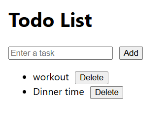

# React TypeScript Todo List

A simple and fully functional **Todo List** application built with **React** and **TypeScript**, demonstrating proper typing, component structure, and state management.

---

## Features

- Add new todos
- Mark todos as completed
- Delete todos
- Fully typed with TypeScript
- Component-based structure (`TodoItem` component)
- Simple and clean styling

---

## Project overview

